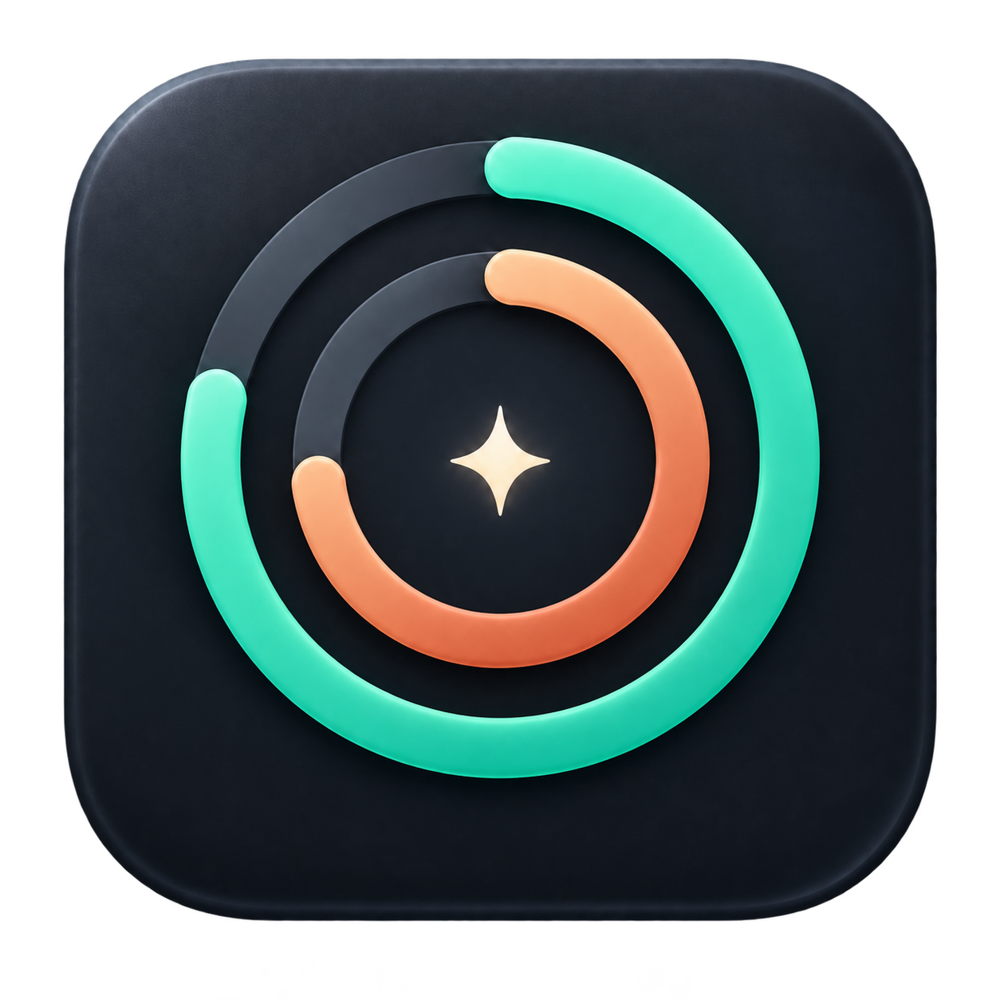
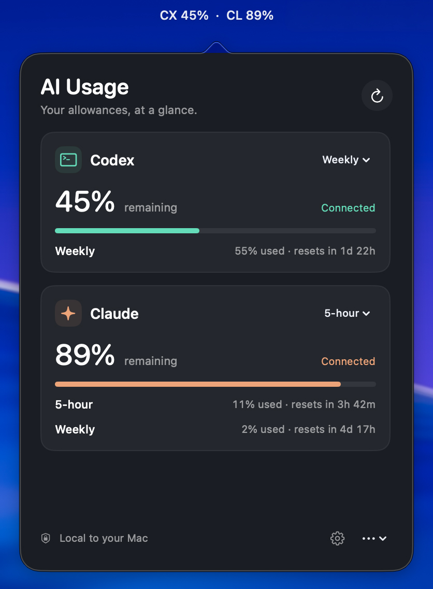

<p align="center">
  
</p>

# AI Usage

Your Codex and Claude allowances, at a glance in the macOS menu bar.

AI Usage shows each provider's real usage percentages and reset times. Choose
which window to display for each provider, switch between used and remaining,
and optionally receive alerts as your allowance runs low.

<p align="center">
  
</p>

## Features

- Separate Codex and Claude percentages in the menu bar.
- Official provider icons in the dropdown, with letters, icons, or both in the menu bar.
- Compact dropdown with reported usage windows and reset countdowns.
- Independent short-window or weekly selections for each provider.
- Used / remaining display preference.
- Optional alerts at 80% and 95%, and when an exhausted allowance renews.
- Launch at login, background refresh, and official CLI reconnect flows.
- Clear disconnected, stale, and unavailable states. Missing data never becomes 0%.

## Install from source

This initial public version is a source release. A prebuilt, notarized Mac download
is not available yet. Xcode is not needed to use a future prebuilt download;
compiling this source requires a Swift 6 toolchain.

Requirements:

- macOS 14 or later.
- Swift 6 or later and the macOS SDK (Xcode or Command Line Tools).
- The official [Codex CLI](https://developers.openai.com/codex/cli) and/or
  [Claude Code](https://code.claude.com/docs/en/setup), installed and signed into
  the subscription account you want to monitor. Either provider can be used alone.

```sh
git clone https://github.com/tommep/ai-usage-plugin.git
cd ai-usage-plugin
swift test
zsh scripts/build-app.sh
```

Copy `build/AI Usage.app` into **Applications**, then open it. Click the
`CX … · CL …` item in the menu bar to see your allowances. The app runs in the
menu bar without a Dock icon. Settings are available through the gear button.
Under **Menu bar → Labels**, choose **Letters**, **Icons**, or **Both**. Percentages
stay visible in every mode, and your choice is saved automatically.

The build script signs locally with an ad hoc signature. This is intended for
building on your own Mac, not distributing downloaded binaries to other users.
No third-party Swift packages are required. Builds target the current Mac's
architecture; Intel runtime behavior has not been tested.

## Connecting accounts

AI Usage reuses the providers' existing CLI sign-ins. A missing CLI opens its
installation page. **Reconnect** opens the provider's official sign-in command
in Terminal; finish that flow in your browser and the app refreshes automatically.
The app does not handle your password or refresh expired Claude tokens itself.

Codex is read through its CLI app-server quota interface. Claude is read through
its internal OAuth usage endpoint, using the existing CLI credential file or
macOS Keychain item. Claude may ask macOS for access to its Keychain item.
Provider changes can affect compatibility, especially Claude's internal endpoint.
These are subscription allowances; pay-as-you-go API billing is not supported.

## Privacy and quota behavior

- Credentials are read locally and are not saved in app preferences or printed
  to logs. Claude's token is sent only to Anthropic's usage endpoint.
- AI Usage has no analytics service. Provider CLIs retain their own behavior and
  policies.
- Refreshes run every five minutes, with a 15-minute cooldown after throttling
  and refresh on wake. Evidence older than ten minutes is marked stale.
- Last known percentages stay in the menu bar in orange when a refresh fails,
  evidence gets old, or the selected window expires. The panel and menu bar
  tooltip explain the stale reading; throttling also shows a retry countdown.
  Fresh data restores the normal color. Revoked login clears the old account's
  reading, and unknown usage is shown as a dash. Usage snapshots are kept in
  memory for the current app session.
- Reset countdowns use provider-reported dates. The app waits for fresh evidence
  before showing renewed capacity; it never invents a reset or missing window.
- Alerts start from a quiet baseline and are sent once per threshold per window.
  A jump over both thresholds produces one 95% alert. Renewal alerts require
  previously observed 100% exhaustion and a newly reported window with capacity.
- Notifications are optional and silent. macOS Focus settings may suppress banners.
- Preferences and the alert history stay in the app's local UserDefaults domain.

## Contributing

Bug reports and focused fixes are welcome. Fork the repository, make a change,
and submit a pull request. Maintainers review changes before merging them into
the official app. See [CONTRIBUTING.md](CONTRIBUTING.md) for build and test details.

A merged pull request does not update installed apps. Public app releases are a
separate maintainer step. There is no automatic updater in this version.

For credential or security concerns, use the private reporting process in
[SECURITY.md](SECURITY.md).

## License

[MIT](LICENSE). The app icon was AI-generated and is included with the project.
Bundled provider artwork comes from the official Codex and Claude desktop apps;
provider names, icons, and trademarks belong to their respective owners and are
not covered by this project's MIT license.
AI Usage is an independent utility, not an official OpenAI or Anthropic product.
